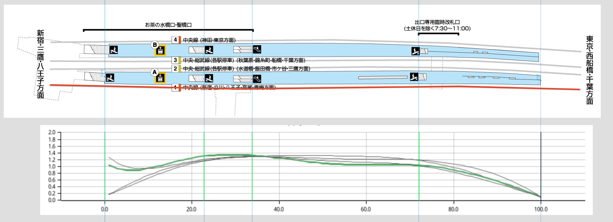

# Cumulative distribution of train passengers

Models the distribution of passengers inside a train along its journey. Higher density means higher probability of more people in that section of the train carriage. This is the probability density function of a mixture distribution.

It assumes that the biggest/only factor in the spatial distribution of passengers is the location of "stairs" (stairs and escalators) on station platforms.

Two random beta distributions are generated for every "stair" location, one with a larger and the other a smaller variance. A smaller random uniform distribution is also generated. The three form a mixture distribution and is weighted then summed. The summed pdf for every stair is summed for every station, giving a pdf for boarders at every station. Some passengers in the train will alight whilst some board, so the final distribution after each station is another mixture distribution consisting of the current passengers in the train weighted by the proportion of remaining passengers, plus the boarders.

The bright green lines represents the x-position of the stairs for every station. The colored lines are the probability density function of the spatial distribution of passengers along the 1D train.

The probability density function *m* of passenger spatial distribution for every station *i* is therefore:

$$m_0=b_0$$

$$m_i=(m_{i-1}\times p_{1-b})+(b_i\times p_b)$$

$$b_i=\sum_{j=0}^{n_j}\frac{S_j}{n_j}$$

$$S_j=(B_c\times p_c) + (B_f\times p_f) + (U\times p_u)$$

- $b_i$ is the distribution of passengers boarding the train at station $i$
- $p_b$ is the proportion of total passengers that are boarders from station $i$
    - The remaining passengers are passengers alighting at station $i$
    - This means the current implementation models alighting passengers with a uniform distribution
- $j$ is the j-th stair at station $i$
- $n_j$ is the number of stairs at station $i$
- $S_j$ is the distribution of boarders coming from stair $j$
- $B$ is the pdf of the beta distribution; $B_c$ means with a small variance and $B_f$ means a large variance
- $U$ is the pdf of the uniform distribution (supported on the platform boundaries)
- $p_c$ is the proportion of boarders from a particular stair with the small variance spatial process
- $p_f$ is the proportion of boarders from a particular stair with the far variance spatial process
- $p_u$ is the proportion of boarders from a particular stair with the uniform random spatial process
- $p_c + p_f + p_u = 1$ and all three are >= 0
- $p_b + p_{1 - b} = 1$ and both are >= 0

This assumes each stair in the station is uniformly important, but this might not be true, as some passengers might be predominantly from particular stairs. The equation can be easily adapted to support data for stair traffic:

$$b_i=\sum_{j=0}^{n_j}\frac{S_j}{p_j}$$

Where $p_j$ is the probability of passengers coming from stair $j$. $\sum_{j=0}^{n_j}p_j$ must equal 1

The beta distribution is used because it is more appropriate to model proportions (which is bounded between 0-1 exclusive). For values exactly at 0 and 1, it turns it into 0.01 and 0.99 for the beta distribution. The normal distribution would cause edge effects on the boundaries because values outside the boundary was clamped. The alternative was to ignore those values, but that would cause the integral of the "pdf" to be less than 1.

Origin-destination data is used to model passengers alighting the train cumulatively.

As the train moves from Tokyo to Kanda, some passengers alight the train and some board it. Thus the cumulative distribution of the train after Kanda is a mixture of the Tokyo and Kanda distributions. This is why the KDE for Kanda still resembles Tokyo.

Ochanomizu and Yotsuya has stairs on the far end of the platform, with the latter actually beyond the train carriage. The result is an increase in the density of passengers on the left side of the train.

This chart shows the same data but in the same plot for easier inter-station comparison. The density on the left (front of train) after Ochanomizu and Yotsuya is immediately observable.

## Potential extensions

- Proper OD data (the current OD data is probably commuter tickets only)
- Easily adjustable variables
- [Crowd simulation](https://en.wikipedia.org/wiki/Crowd_simulation) to model passengers dispersing throughout the train, as passengers do not mindlessly cluster together when there is space along the train
- Consider that some alighting passengers will exit at a location close to the stairs they plan to go through (currently a uniform distribution is subtracted)
- Consider that some passengers will board at a location convenient for their destination station
- Consider variables such as shelter (for rainy weather)
- Evaluate model with real world data of passenger distributions

## Applications

- Suggest passengers where to wait to mitigate overcrowding
- Pricing advertisements on the platform based on crowd sizes
- Inform future station layout design
- Understand spatial processes of people in transit through detailed slices of time
- As a replacement for lack of real world measurements of passengers distributions

## Usage

1. Install rust/cargo
2. `mkdir out`
3. `cargo run`

## Data sources

- Station platform layout
    - https://www.jreast.co.jp/map/
    - eg: https://www.jreast.co.jp/estation/stations/1039.html
- Origin-destination data
    - https://www.mlit.go.jp/sogoseisaku/transport/sosei_transport_tk_000035.html
    - Processing done by me as part of [directed readings coursework](https://github.com/akazukin5151/papers/blob/main/6SSG3040_CW1_1931393.pdf)

## References

- Kruschke, John K. (2015). Doing Bayesian Data Analysis (Second Edition). Chapter 6.2

## Q&A

- Why not use Python?

Well I initially did use it. But `pdm sync` didn't work at all because apparently I have a python package without a name or package metadata, so `pdm` crashes because it assumes there always is metadata.

Well whatever I'll just not use pdm and just tell users to "download this list of dependencies and hope it works".

Unfortunately matplotlib didn't work because some dynamically linked library was the wrong version. No problem, there's a workaround. But it didn't fix the broken linking. I went to my [marey](https://github.com/akazukin5151/marey) repo, and it crashes because the workaround is script-specific.

I solved the issue by disabling conda. But now I have no pdm, no conda, just relying on system Python. Which is guaranteed to break in a update three months later

I just can't use something that is guaranteed to break every three months.
