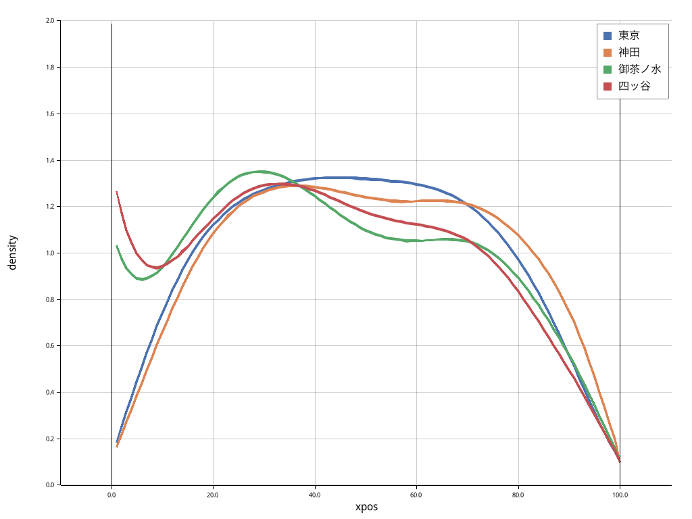

# Cumulative distribution of train passengers

Simulates the distribution of passengers inside a train along its journey. Higher frequency means higher probability of more people in that section of the train carriage.

It assumes that the biggest/only factor in the spatial distribution of passengers is the location of "stairs" (stairs and escalators) on station platforms.

A random beta distribution is generated for every "stair" location, plus a smaller random uniform distribution. This is added up for every station cumulatively. Origin-destination data is used to model passengers alighting the train cumulatively.

The beta distribution is used because it is more appropriate to model proportions (which is bounded between 0-1 exclusive). For values exactly at 0 and 1, it turns it into 0.01 and 0.99 for the beta distribution. The normal distribution would cause edge effects on the boundaries because values outside the boundary was clamped. The alternative was to ignore those values, but that would decrease the number of passengers generated.

The green lines represents the x-position of the "stairs" for every station. The blue line is the KDE of the spatial distribution of passengers along the 1D train. Observe that there is a slight increase in density around the "stairs".

As the train moves from Tokyo to Kanda, some passengers alight the train and some board it. Thus the cumulative distribution of the train after Kanda is a mixture of the Tokyo and Kanda distributions. This is why the KDE for Kanda still resembles Tokyo.

Ochanomizu and Yotsuya has "stairs" on the far end of the platform, with the latter actually beyond the train carriage. The result is an increase in the density of passengers on the left side of the train.

This chart shows the same data but in the same plot for easier inter-station comparison. The density on the left (front of train) after Ochanomizu and Yotsuya is immediately observable.

Comparing Tokyo and Kanda, positions 60-100 has increased density after Kanda, whilst the rest of the train is more dense in Tokyo.

A naive way of modeling passenger dispersion to increase personal space is to increase the bandwidth for the kernel density estimate. This chart increases the bandwidth multiplier, smoothing out small differences, emphasizing focus on broader, larger scale differences. For example, the right-side stairs in Kanda increased passenger density on the right, but then decreases after Ochanomizu and Yotsuya as their stairs are on the left and center of the platform.

The proper way is to use [crowd simulation](https://en.wikipedia.org/wiki/Crowd_simulation), but the depth is out of scope for this open source repo. Hopefully it will inspire someone else to dig deeper!

## Potential extensions

- Proper OD data (the current OD data is probably commuter tickets only)
- Easily adjustable variables (eg, mean and stdev of beta distributions)
- [Crowd simulation](https://en.wikipedia.org/wiki/Crowd_simulation) to model passengers dispersing throughout the train, as passengers do not mindlessly cluster together when there is space along the train
- Consider variables such as shelter (for rainy weather)
- Consider that some passengers will board at a location convenient for their destination station
- Evaluate model with real world data of passenger distributions

## Applications

- Suggest passengers where to wait to mitigate overcrowding
- Understand spatial processes of people in transit through detailed slices of time
- Inform future station layout design
- As a replacement for lack of real world measurements of passengers distributions

## Usage

1. Install rust/cargo
2. `mkdir out`
3. `cargo run`

## Data sources

- Station platform layout
    - https://www.jreast.co.jp/map/
    - eg: https://www.jreast.co.jp/estation/stations/1039.html
- Origin-destination data
    - https://www.mlit.go.jp/sogoseisaku/transport/sosei_transport_tk_000035.html
    - Processing done by me as part of [directed readings coursework](https://github.com/akazukin5151/papers/blob/main/6SSG3040_CW1_1931393.pdf)

## Q&A

- Why not use Python?

Well I initially did use it. But `pdm sync` didn't work at all because apparently I have a python package without a name or package metadata, so `pdm` crashes because it assumes there always is metadata.

Well whatever I'll just not use pdm and just tell users to "download this list of dependencies and hope it works".

Unfortunately matplotlib didn't work because some dynamically linked library was the wrong version. No problem, there's a workaround. But it didn't fix the broken linking. I went to my [marey](https://github.com/akazukin5151/marey) repo, and it crashes because the workaround is script-specific.

I solved the issue by disabling conda. But now I have no pdm, no conda, just relying on system Python. Which is guaranteed to break in a update three months later

I just can't use something that is guaranteed to break every three months.
